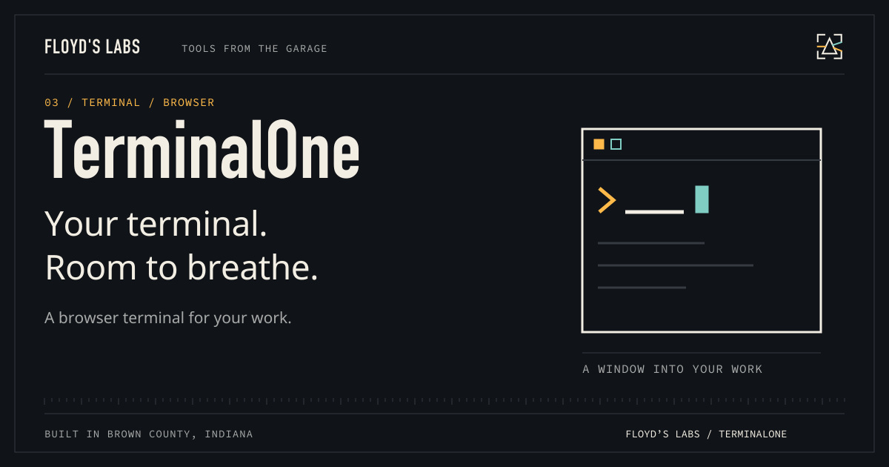

# TerminalOne



**Your shell. A browser. Some breathing room.**

A local browser terminal with a real PTY, session resume, themes, keyboard tools, and a responsive interface. Built at Floyd’s Labs: one garage, two black cats, and tools that have to earn the desk space.

[Download v1.0.1](https://github.com/CaptainPhantasy/TerminalOne/releases/tag/v1.0.1) · [Report a bug](https://github.com/CaptainPhantasy/TerminalOne/issues) · [Floyd’s Labs](https://floyd-labs-proving-ground.captainphantasy.chatgpt.site/open-source)

## Get it running

Requirements: **Node.js 22.x and npm; macOS or Linux**.

Download `terminalone-1.0.1.tgz`, unpack it, and install dependencies:

```sh
mkdir terminalone && tar -xzf terminalone-1.0.1.tgz -C terminalone
cd terminalone/package
npm ci --omit=dev
npm run doctor
npm start
```

Open `http://localhost:11001`. The server binds to `127.0.0.1` and rejects untrusted Host headers and cross-site HTTP/WebSocket origins. A terminal can run commands with your account's permissions. Keep it local. Network access requires a separately configured authenticated tunnel or proxy; the package does not provide remote authentication.

Session resume keeps detached shells for up to five minutes. Browser settings persist locally. Voice transcription is optional and requires a compatible external STT command; it is not a bundled speech model. If a native module needs repair, run `npm run repair`.

## What is in the box

The release includes `terminalone-1.0.1.tgz`, source where applicable, and `SHA256SUMS.txt`. Use the tagged release's named assets for installation; GitHub's automatic source archives are snapshots. Verify a download with `shasum -a 256 -c SHA256SUMS.txt` after downloading the matching files.

## Show the work

`npm ci` installs development dependencies. `npm test` covers request boundaries, input handling, browser smoke behavior, resume/mobile features, voice transport, and responsive layouts. A fresh release install is separately started and checked through HTTP and WebSocket. External STT and remote access are not verified integrations.

## Contribute or get help

Open an issue with your platform, version, command, and a minimal reproduction. Keep credentials and personal transcripts out of reports. See [CONTRIBUTING.md](CONTRIBUTING.md) and [SECURITY.md](SECURITY.md).

## License

MIT — see [LICENSE](LICENSE).

---

Built with intent. Bella checks the keyboard. Bowser watches the router.
